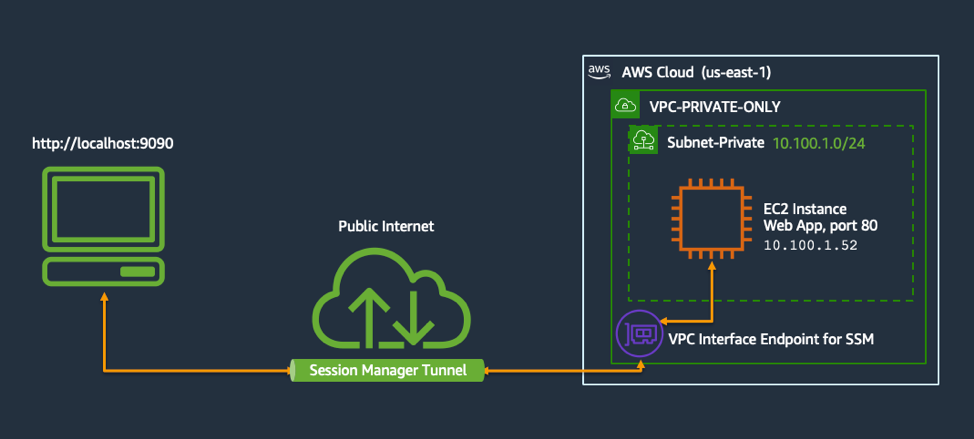

# Atun - AWS Tagged Tunnel
[](https://github.com/AutomationD/atun/actions/workflows/tests.yml)

SSH tunnel cli tool that works without local configuration. It uses EC2 tags to define hosts and ports forwarding
configuration.
`atun.io/` [schema namespace](#tag-metadata-schema) can be used to configure an SSM tunnel.


## WIP

This tool is still in development and versions before 1.0.0 might have breaking changes.
Be ready that commits might be squashed/reset and tags might be rewritten until 1.0.0

## Quickstart

### Install from Homebrew
```bash
brew tap automationd/tap
brew install atun
```


_(This is a MOCK Demo. Will update it soon)_

## Features

This tool allows to connect to private resources (RDS, Redis, etc) via EC2 bastion hosts without public IP (via SSM).
At the moment there are only three commands available: `up`, `down`, and `status`.

## Tag Metadata Schema

In order for the tool to work your EC2 host must emply correct tag [schema](schemas/schema.json).
At the moment it has two types of tags: Atun Version and Atun Host.

- **Version** Tag Name = `atun.io/version`
- **Version** Tag Value = `<schema_version>`
- **Env** Tag Name = `atun.io/env`
- **Env** Tag Value = `<environment_name>`
- **Host** Tag Name = `atun.io/host/<hostname>`
- **Host** Tag Value = `{"local":"<local_port>","proto":"<protocol>","remote":<remote_port>}`

### Host Config Description

- local: port that would be bound on a local machine (your computer)
- proto: protocol of forwarding (only `ssm` for now, but might be `k8s` or `cloudflare`)
- remote: port that is available on the internal network to the bastion host.

### Example

| AWS Tag                                                                        | Value                                           | Description                                                               |
|--------------------------------------------------------------------------------|-------------------------------------------------|---------------------------------------------------------------------------|
| `atun.io/version`                                                              | `1`                                             | Schema Version. It might change if significant changes would be intoduced |
| `atun.io/env`                                                                  | `dev`                                           | Specified environment of the bastion host                                 |
| `atun.io/host/nutcorp-api.cluster-xxxxxxxxxxxxxxx.us-east-1.rds.amazonaws.com` | `{"local":"23306","proto":"ssm","remote":3306}` | Describes host config and how to forward ports for a MySQL RDS            |
| `atun.io/host/nutcorp.xxxxxx.0001.use0.cache.amazonaws.com`                    | `{"local":"26379","proto":"ssm","remote":6379}` | Describes host config and how to forward ports for ElastiCache Redis      |

## Usage
There are two ways to use this tool: when an infra has a bastion with `atun.io` schema tags and when it doesn't have it yet.

### Create a Bastion Host
When an infra doesn't have a bastion host yet (let's say this is an adhoc connection), it's possible to create a bastion host with this tool.

```shell
atun create
```

### Bring up a tunnel
```bash
atun up
```

### Bring down a tunnel

```bash
atun down
```

### Check the status of the tunnel

```bash
atun status
```

## Development & Contributing
### Install from Homebrew (dev version)
```bash
brew tap automationd/tap
brew install atun --build-from-source
```
If the dev version has cached old metadata (b/c version is the same), use this command:
```shell
brew update && brew fetch --force atun && brew reinstall atun
```
